1. Load grass_main.png mapres image file via the central "Select Image" button, click `File` > `Open image` or press `Ctrl+O`.

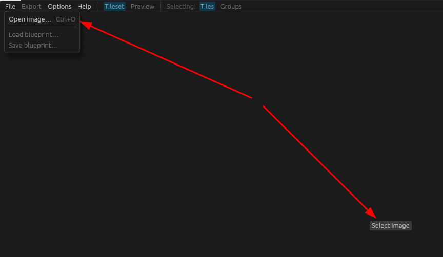

2. Verify you are in `Tileset` mode selecting `Tiles`.

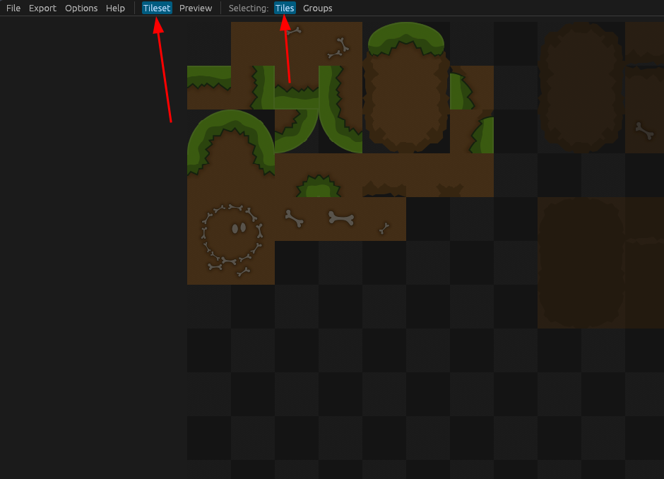

3. Select the neutral dirt tile, and configure your first rule: set all neighboring tiles to be `any`.

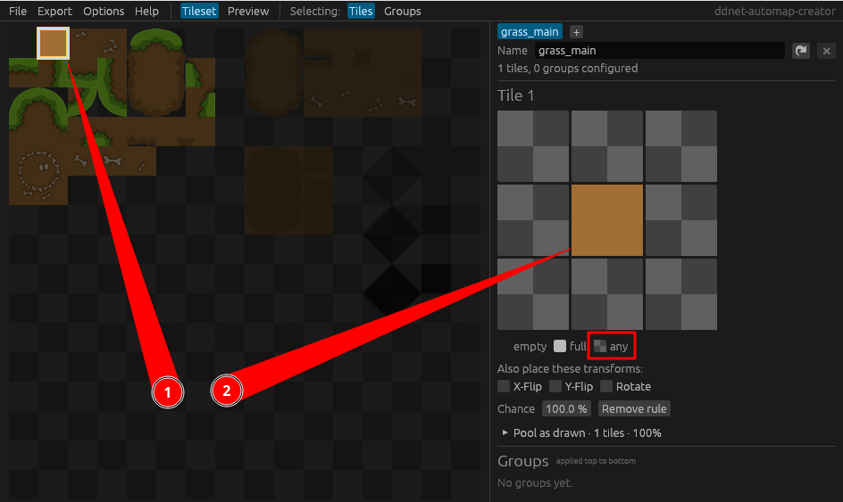

4. Switch to the `Preview` mode to see your first rule in action (check the available preview maps)

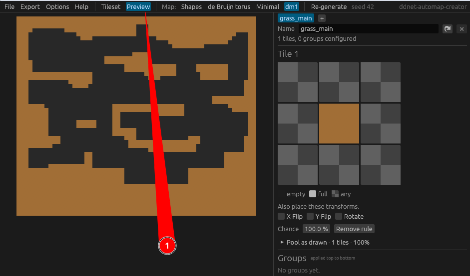

5. Go back to the `Tileset` mode and create more rules: Select the top-grass tile and configure the block above it to be `empty`, the top corner ones to be `any`, the remaining ones need to be `full`.

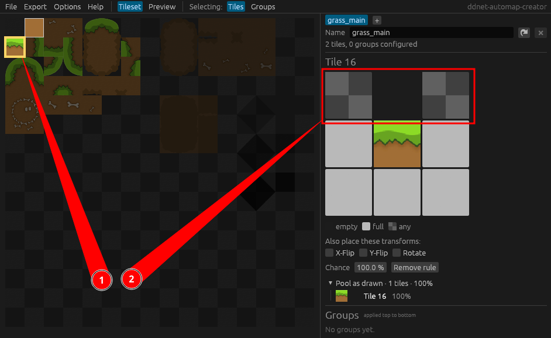

6. Now you will see top-blocks grow grass on top. If you enable "Y-Flip" for the rule, it will also add the rule in its y-flipped form, so grass grows on the bottom too. Go ahead and enable "Rotate" to add the rule in all 4 rotated variants, so grass grows on all sides.

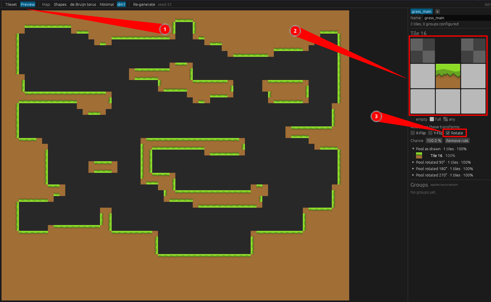

7. Now lets add a rule for a corner tile. Enable "Rotate" to add the rule in all 4 possible rotations. You should now see grass grow on edges in all orientation.

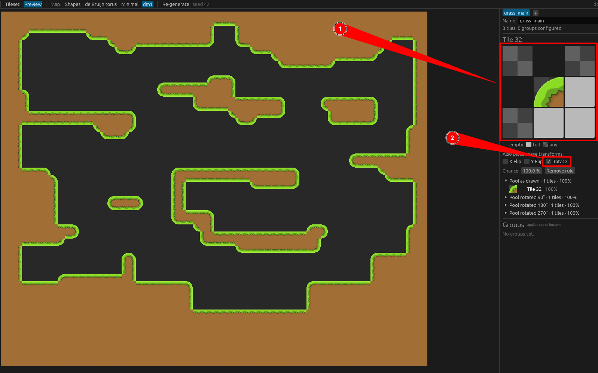

8. Lastly, add a rule for the inward corners, also toggle "Rotate" to get rules for all 4 rotated variantions.

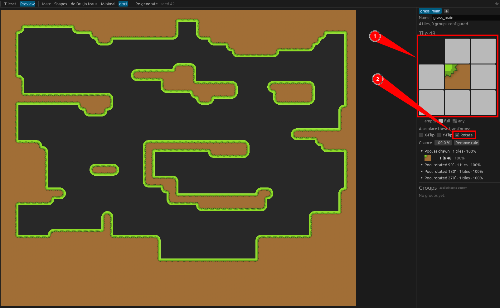

9. If you want some random decoration you can also add bone tiles. First: set the rule for the normal solid block to require full blocks around it. Then add the same rule for the bone tile. However, for the bones lower the chance to a low value such as 1%. You should see the normal dirt block and its bone variant share a pool, with the bone tile taking up 1%.

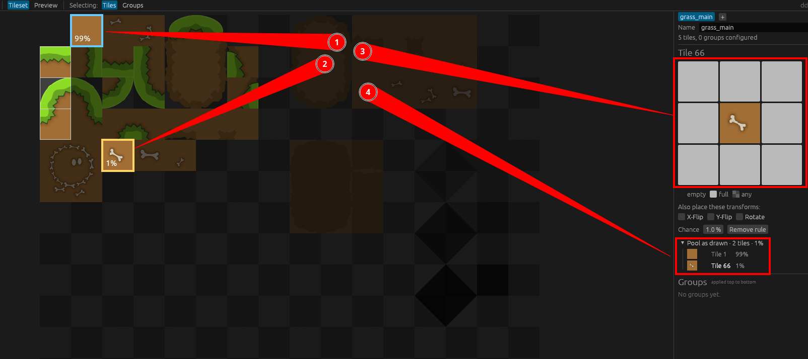

10. In the preview tab you should now see a few scattered bones. Press the `Re-generate` button to get a new random generation.

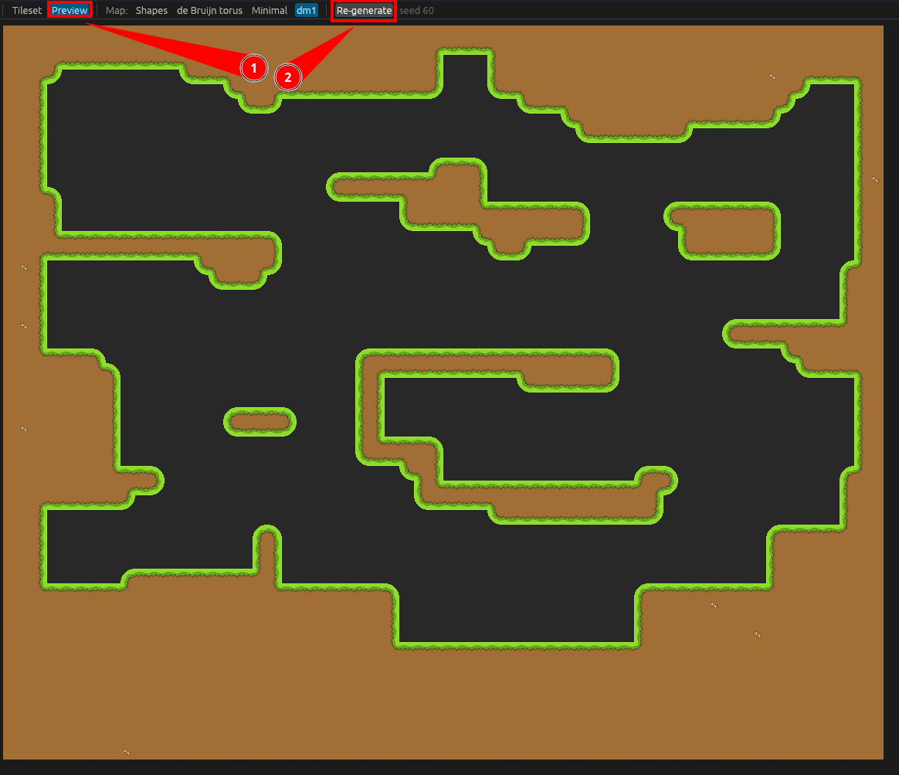

11. To save your progress press `File` > `Save Blueprint`, this will store the entire UI state in a file that you can load again using `Load Blueprint`. Now press the `Export` button, to get an actually DDNet compatible `.rules` file. I'm assuming that you know what do do it.

12. Now you know the basics of this tool. The tutorial will cover more complex features in the future. If you want to challange yourself, try to recreate the ruleset to make grass only grow on the top-side of dirt blocks, like you can see here. See solution below.

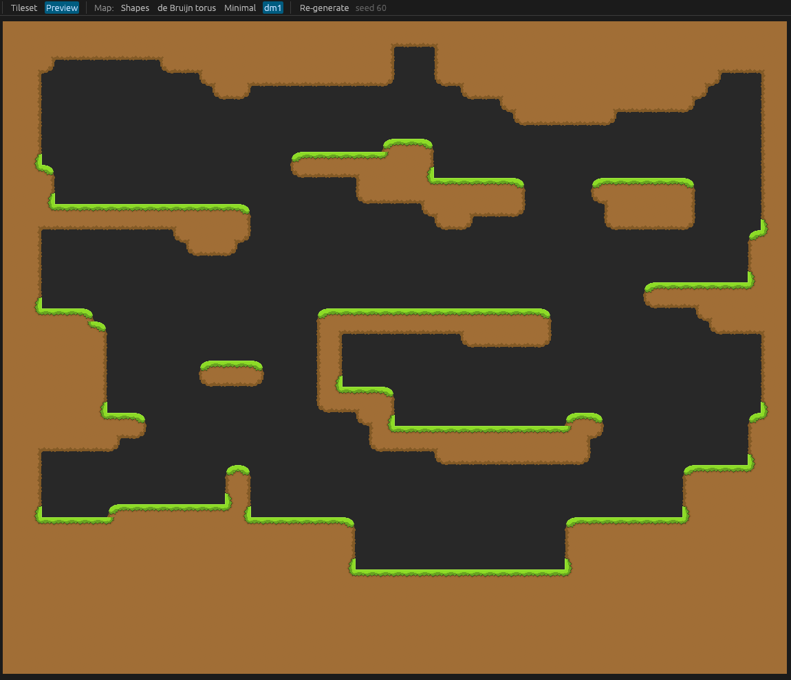

Solution (Spoiler)

[Solution Blueprint](./grass_main.json)

Download the raw file and load it using `File` > `Load Blueprint` while having `grass_main.png` open. Warning: this will overwrite your current session. Safe your progress! :)

Otherwise, here are screenshots of the rules:

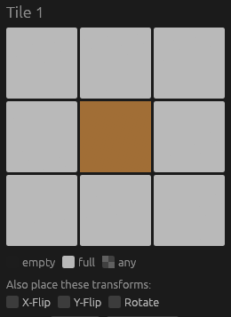
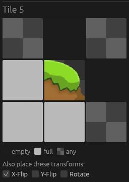
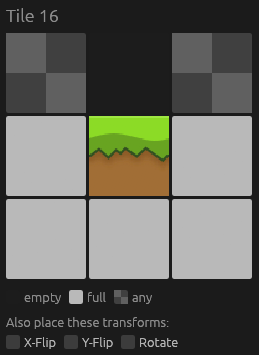
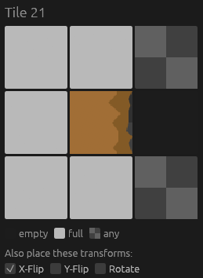
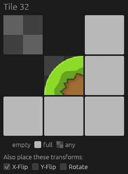
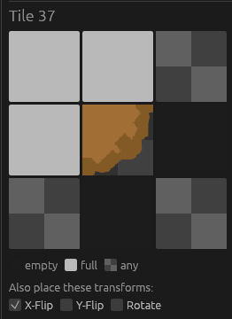
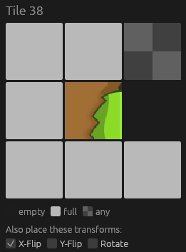
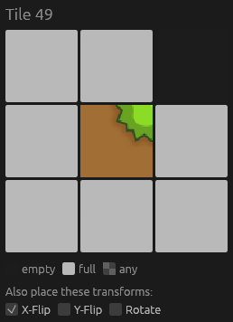
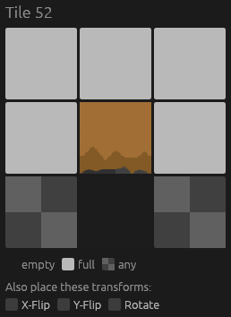
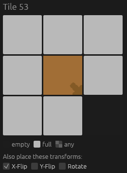

_idk if this is the optimal solution_

